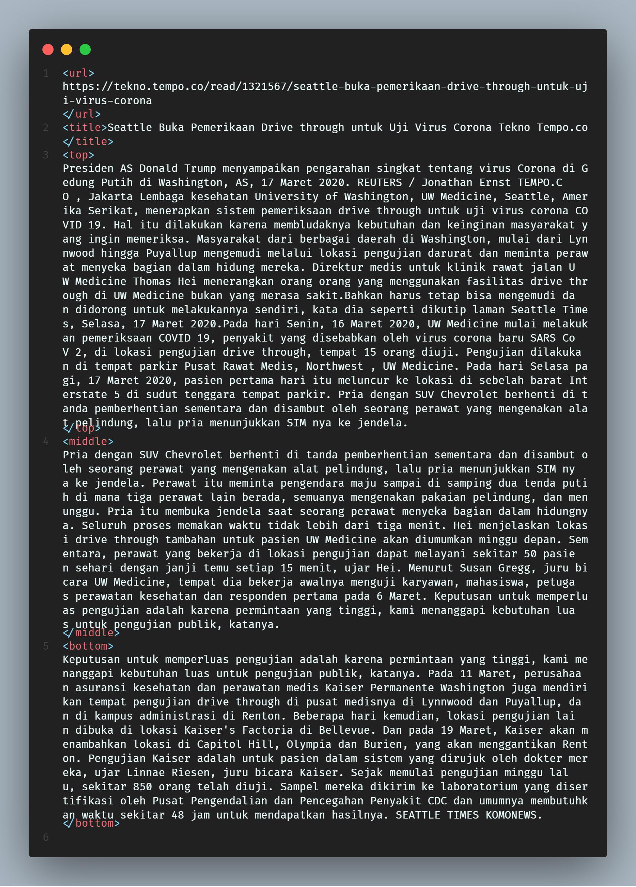

# 1-to-3-grams-dictionary

## Run program
1. make sure your file clean format like this

2. run this syntax
```
    $ perl dictionary.pl <source clean file directory>
```
3. output format format be like this with delimiter ":"

| Word  | frequency | frequency normalization |
| :--- | :---: | :---: |
| Another  | 7328  | 0.00000196 |

## Requirement
- [Lingua::EN:Ngram](https://metacpan.org/pod/Lingua::EN::Ngram)
